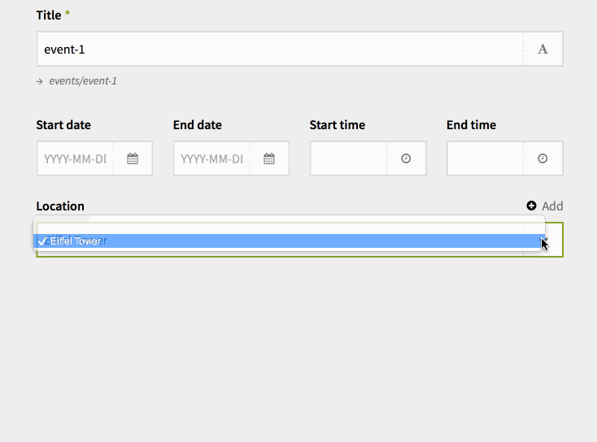

## Donate

If you enjoy this plugin and want to support the development of this and other plugins you can [buy me a present](https://www.paypal.me/texnixe/5eur) :)

# Kirby Selectplus Field

This field adds an add button to a select field that allows you to add new options to a select field on the fly. It is only intended to work with select fields that query subpages of a given folder.

Example use case: In an event page, you have a select field that allows you to select a location. Locations are stored as subpages of the locations page. It may happen that when you create a new event, the location you want to select doesn't exist yet. Usually, you would then have to go to the locations page and add a new location, then go back to your event page and select the new location. With this field, you can do this right from the event page.



## Installation

### Download

[Download the files](https://github.com/texnixe/kirby-selectplus/archive/master.zip) and place them inside `site/plugins/selectplus`.

### Kirby CLI
Installing via Kirby's [command line interface](https://github.com/getkirby/cli):

    $ kirby plugin:install texnixe/kirby-selectplus

To update the Selectplus plugin, run:

    $ kirby plugin:update texnixe/kirby-selectplus

### Git Submodule
You can add the Selectplus plugin as a Git submodule.

    $ cd your/project/root
    $ git submodule add https://github.com/texnixe/kirby-selectplus.git site/plugins/selectplus
    $ git submodule update --init --recursive
    $ git commit -am "Add Kirby Selectplus plugin"

Run these commands to update the plugin:

    $ cd your/project/root
    $ git submodule foreach git checkout master
    $ git submodule foreach git pull
    $ git commit -am "Update submodules"
    $ git submodule update --init --recursive


## Use in blueprint:

```
locations:
    label: Locations
    type: selectplus
    formfields:
      title:
        label:
          en: Name of Event Location
          de: Name des Veranstaltungsort
        placeholder:
          en: Location Name
          de: Veranstaltungsort
        required: true  
      address:
        label:
          en: Address of Location
          de: Adresse des Veranstaltungsortes
        placeholder:
          en: Address
          de: Adresse
    parent: locations
    template: location
    width: 1/3
    options: query
    query:
      page: locations
      fetch: children
      value: '{{uid}}'
      text: '{{title}}'
 ```

### Formfields option

The formfields option accepts a set of fields that you want to have in your form. For each form field, you can set a label, a placeholder and a required attribute. Each field is a standard text input field. While you can create as many fields as you want, one or two should actually be sufficient to create a new option on the fly.

### Parent
The name of the parent page where the options will be created. The page must exist.

### Options query text

The field you show as text for the select option should be a required field in your formfields options, otherwise your select field option will show an empty string, usually, this will be the title.

## Disclaimer

This plugin is provided "as is" with no guarantee. Use it at your own risk and always test it yourself before using it in a production environment. If you find any issues, please create a new issue.


## Changelog

1.2.0 Fixed an issue where the page could not be saved using the save button due to required fields.

## License

The Selectplus plugin is open-sourced software licensed under the [MIT license](http://www.opensource.org/licenses/mit-license.php).

Copyright © 2018 Sonja Broda info@texniq.de https://www.texniq.de

It is discouraged to use this plugin in any project that promotes racism, sexism, homophobia, animal abuse, violence or any other form of hate speech.
